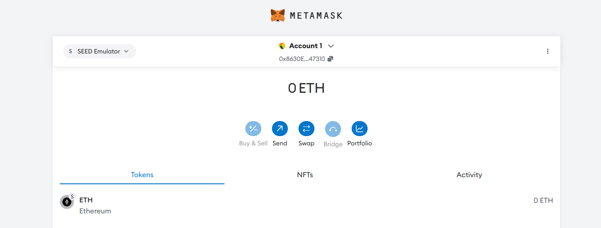
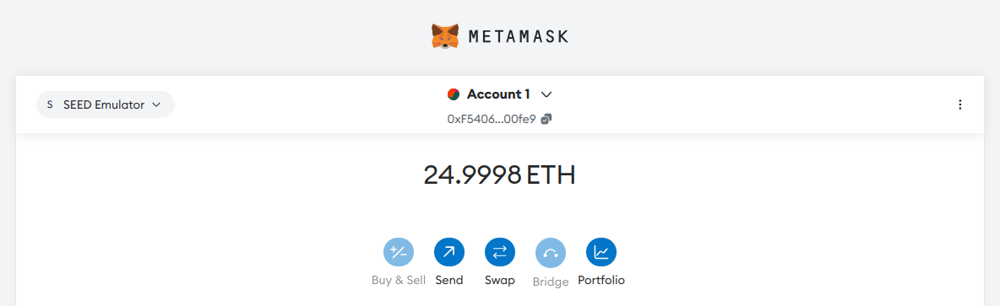

# Logbook for Lab 02 - Blockchain Exploration Lab

## Purpose

The purpose of this lab is the exploration of the Ethereum blockchain, using tools such as MetaMask, Python, and Geth. The lab demonstrates an understanding of blockchain concepts by setting up a MetaMask wallet, interacting with blockchain nodes, sending transactions, and developing Python scripts to programmatically interact with the blockchain. Additionally, it explores the process of joining an existing blockchain network by configuring a new node and performing transactions.

## Task 1 - Setting Up MetaMask Wallet

MetaMask is a popular wallet application for the Ethereum blockchain and it is available as a browser extension and in a standalone mobile application. In this lab, we will use the browser extension.

### Task 1.A - Installing the MetaMask extension

MetaMask was installed as a Firefox browser extension within the virtual machine. The installation process involved navigating to Firefox’s Add-ons menu, searching for MetaMask, and installing the extension developed by *danfinlay*.


### Task 1.B - Connecting to the Blockchain

After the MetaMask installation, we were able to connect our local Ethereum Blockchain emulator, which contained some blocks. These blocks are docker containers, identitied with their names and IP addresses:


When we went to the MetaMask configuration, we selected one of the availables node IP addresses to perform the manual connection:

```text
Network name: SEED emulator
New RPC URL: http://10.160.0.71:8545
Chain ID: 1337
Currency symbol: ETH
```

This connection allowed MetaMask to interact directly with the blockchain, enabling account management and transaction capabilities.



### Task 1.C - Adding accounts

In this subtask, existing accounts were added to the MetaMask wallet. These accounts were pre-generated and they already had balances in Ether. To import them, the recovery phrase provided in the lab instructions was used:

```text
gentle always fun glass foster produce north tail security list example gain
```

This recovery phrase represents a mnemonic that allows MetaMask to restore the accounts associated with it. These accounts were now accessible for conducting transactions on the blockchain. We enabled the "Show conversion on test networks" option to see the accounts balance:


### Task 1.D - Sending transactions

After setting up the MetaMask wallet and adding accounts, the next step was to perform a Ether transaction between two accounts. Ether was transferred from one account to another using MetaMask's transaction functionality.

We selected the source account, the amount of Ether and the destination account. MetaMask processed the transaction, and after confirmation on the blockchain, the balances of both accounts were updated accordingly. The transaction details were then verified using EtherView:


## Task 2 - Interacting with Blockchain Using Python

In this task, the goal was to interact with the Ethereum blockchain using Python in order to obtain more control and flexibility in the interactions, exploring how to connect to a blockchain node, retrieve account balances, and send transactions directly.

### Task 2.A - Installing Python modules

We installed the `web3` and `docker` modules to run the following tasks:

```sh
$ pip3 install web3==5.31.1 docker
```

### Task 2.B - Checking account balance

In this task, a Python script was used to check the Ethereum account balances. The script connected to a specific Ethereum node hosted within the emulator and retrieved the balance of the selected account. After replacing the url in the script with the IP address we obtained in task 1.B., we ran the script for each of the three accounts:

- Account 1 - the address used in the script was `0xF5406927254d2dA7F7c28A61191e3Ff1f2400fe9`


- Account 2 - the address used in the script was `0x2e2e3a61daC1A2056d9304F79C168cD16aAa88e9`


- Account 3 - the address used in the script was `0xCBF1e330F0abD5c1ac979CF2B2B874cfD4902E24`


The results of the executions match what we see in the MetaMask wallet, except for Account 3, which in MetaMask shows a balance of 4 Ether, instead of 3.999978999999853 Ether (probably due to it rounding the account balance).

### Task 2.C - Sending transactions

In this task, a Python script was developed to send a transaction from one Ethereum account to another. The script signed the transaction locally and sent it to the blockchain. The content of `web3_raw_tx.py` was the following:

```python
#!/bin/env python3
from web3 import Web3
from eth_account import Account

web3 = Web3(Web3.HTTPProvider('http://10.160.0.71:8545'))

# Private key of Account 1 (Sender)
key = '72c28c0d980b5e26435fc7eb8afaa27a5a117359669d73284f69ed8a401c6a85'
sender = Account.from_key(key)

# Public address of Account 3 (Recipient)
recipient = Web3.toChecksumAddress('0xCBF1e330F0abD5c1ac979CF2B2B874cfD4902E24')
tx = {
    'chainId': 1337,
    'nonce': web3.eth.getTransactionCount(sender.address),
    'from': sender.address,
    'to': recipient,
    'value': Web3.toWei("11", 'ether'),
    'gas': 200000,
    'maxFeePerGas': Web3.toWei('4', 'gwei'),
    'maxPriorityFeePerGas': Web3.toWei('3', 'gwei'),
    'data': ''
}
 
# Sign the transaction and send it out
signed_tx = web3.eth.account.sign_transaction(tx, sender.key)
tx_hash = web3.eth.sendRawTransaction(signed_tx.rawTransaction)

# Wait for the transaction to appear on the blockchain
tx_receipt = web3.eth.wait_for_transaction_receipt(tx_hash)
print("Transaction Receipt: {}".format(tx_receipt))
```

This script initiated a transaction where 11 Ether was transferred from the sender to the receiver account. The transaction was signed using the sender's private key and broadcasted to the blockchain, and the hash generated was used to track the status of the transaction:


## Task 3 - Interacting with Blockchain Using Geth

This task focused on using Go Ethereum (Geth) as a command-line interface for interacting with the instantiated Ethereum blockchain. Geth can execute transactions and retrieve blockchain data to check account balances and sending transactions directly from the command line.

### Task 3.A - Getting balance

The goal was to retrieve the balances of the first three accounts from the MetaMask wallet using the Geth JavaScript console. The following commands was executed in the Geth console to retrieve the account balances:

```sh
eth.getBalance("0xF5406927254d2dA7F7c28A61191e3Ff1f2400fe9");
eth.getBalance("0x2e2e3a61daC1A2056d9304F79C168cD16aAa88e9");
eth.getBalance("0xCBF1e330F0abD5c1ac979CF2B2B874cfD4902E24");
```





### Task 3.B - Sending transactions

In this subtask, we sent transactions between different accounts within the Geth environment. Each node maintains a list of accounts, which are stored in `/root/.ethereum/keystore` and their address are loaded into the `eth.accounts[]` array. The command used for sending a transaction included specifying the sender's address, the recipient's address, and the amount of Ether to be transferred. The command used for unlock the account and perform the transaction was the follows:

```text
personal.unlockAccount(eth.accounts[0], "admin");

eth.sendTransaction({
    from: eth.accounts[0], 
    to: "0xF5406927254d2dA7F7c28A61191e3Ff1f2400fe9", 
    value: web3.toWei(10, "ether")
})
```

Upon executing the transaction command, the transaction hash was obtained, which served as a unique identifier for tracking the transaction's status on the blockchain. After sending the transaction, the account balances were checked again to confirm the successful transfer of Ether.


### Task 3.C - Sending transactions from a different account

In this subtask, we will attempt to perform a transaction using an account from our MetaMask wallet as the sender. For this, we will use Account 2, with the address `0x2e2e3a61daC1A2056d9304F79C168cD16aAa88e9`.

In the Geth JavaScript console, the following command was executed to perform the transaction:

```javascript
eth.sendTransaction({
    from: "0x2e2e3a61daC1A2056d9304F79C168cD16aAa88e9", 
    to: eth.accounts[0], 
    value: web3.toWei(10, "ether")
})
```


As we can see, the transaction failed because the node does not have the account information for the sender. Without the account information, the node cannot sign the transaction and the process fails.

## Task 4 - Adding a Full Node

In this task, the aim is to add a node to the blockchain network.
To do this, we have to configure an existing empty container, *new_eth_node*, to turn it into one of the Ethereum nodes.

First, we had to initialize the node with the blockchain information. we can get this information from the generic block, which is the first in the chain, by running the following command:`geth --datadir /root/.ethereum init /eth-genesis.json`.


Next, we had to run another command to add the node to the blockchain network. To do this, we need to provide the list of bootnodes to allow the blockchain nodes to connect to each other. So, inside one of the existing Ethereum nodes we can access the file with this list `eth-nodes-url`. We copy this file to the existing file `/temp/eth-node-urls` in the *new_eth_node* container. Run the following command: 


```sh
geth --datadir /root/.ethereum --identity="NEW_NODE_01" --networkid=1337 \
--syncmode full --snapshot=False --verbosity=2 --port 30303 \
--bootnodes "$(cat /tmp/eth-node-urls)" --allow-insecure-unlock \
--http --http.addr 0.0.0.0 --http.corsdomain "*" \
--http.api web3,eth,debug,personal,net,clique,engine,admin,txpool
 ```


After configuring this node, we create a new account for this node. The account information is visible in the following picture.


Once we've changed the code and the node is connected, we use this new node to make transactions. In the following screenshots it can been seen the change in Account 1 (the transaction from this account to the new one).


## Conclusion

In this lab we learned blockchain technology, specifically through exploring Ethereum using tools like MetaMask, Python scripts, and Geth console. Additionally, the process of managing accounts, sending transactions, and syncing a full node to the network offered practical insights into the decentralized nature of blockchain systems.