# Logbook for Lab 03 - Smart Contract Lab

## Purpose

The purpose of this lab is to explore the development and functionality of smart contracts using the blockchain emulator and Remix IDE, understanding the key concepts such as contract deployment, function invocation, and transaction handling on a blockchain. Additionally, we explored how to transfer funds to and from smart contracts, as well as how to handle special scenarios such as invoking non-payable or non-existing functions. 

## Task 1 - Using Remix for Smart Contract Development

In this task, we focused on developing, compiling, and deploying smart contracts using the Remix IDE. We also connected Remix to the SEED blockchain emulator to interact with a private blockchain, allowing us to observe how contracts behave in a real blockchain environment.

### Task 1.A - Connecting Remix to the SEED Emulator

In this step, we connected the Remix IDE to the SEED blockchain emulator using MetaMask, a browser extension that acts as both a wallet and a bridge to the blockchain, installed in the previous SEED lab. By linking Remix to the emulator, we were able to deploy smart contracts to a private blockchain, enabling direct interaction and consulting account balance as well.

### Task 1.B - Write, Compile, and Deploy Smart Contract

In this step, a simple smart contract called `Hello.sol` was created using the Remix IDE. The contract was written in the "contract" folder in Remix by creating a new file and pasting the provided code. After that, the contract was compiled using the "Solidity Compiler" option in Remix and successfully compiled into bytecode, making it ready for deployment.

Once compiled, the contract was deployed on the SEED blockchain emulator. This was done through the "Deploy & Run Transactions" menu in Remix, where MetaMask was selected as the injected provider. MetaMask prompted for transaction confirmation, which initiated the deployment of the smart contract to the blockchain. After a successful deployment, EtherView was used to verify that the transaction was recorded in a new block on the blockchain:


### Task 1.C - Under the hood

In this step, the process behind deploying a smart contract was explored. The previous transaction used to deploy a contract was examined using `EtherView`, where its details were compared to a standard fund-transfer transaction.

The main difference observed was in the data field of the transaction, which contained the contract’s bytecode. This bytecode represents the compiled smart contract and is stored on the blockchain. Unlike a typical fund-transfer transaction, which primarily focuses on the transfer of Ether, a contract deployment transaction includes the code that defines the behavior of the smart contract.

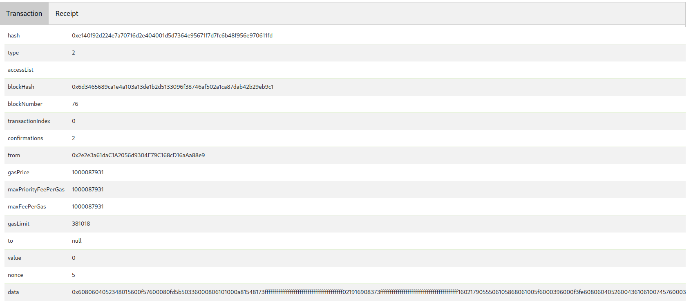

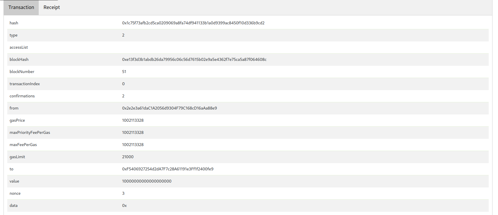

Additionally, the bytecode of the compiled contract was retrieved using Remix’s "Solidity Compiler" menu. This helped to confirm that the data included in the deployment transaction matches the compiled contract.

## Task 2 - Invoke Contract Functions

In this task, we explored how to interact with a smart contract after its deployment. We focused on invoking functions of the `Hello.sol` contract, both through local calls that incur no cost and through transactions that modify the contract's state. Additionally, we analyzed the events emitted during these interactions and examined what happens behind the scenes during the blockchain transactions.

### Task 2.A - Invoke a function via local call

In this step, we invoked the public view functions of the deployed `Hello.sol` contract using local calls. These functions do not alter the contract's state, allowing us to interact with them without incurring any gas fees. We observed the contract's responses to each invocation, confirming that the functions returned the expected results without the need for transaction confirmation.

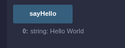

### Task 2.B - Invoke a function via transaction

In this step, we invoked the `increaseCounter()` function of the `Hello.sol` contract through a transaction. Unlike local calls, invoking this function requires a transaction as it modifies the state of the contract. We used the Remix to trigger the function, which prompted MetaMask for transaction confirmation. After the transaction was confirmed, we verified the successful state change by checking the updated counter value in the contract.

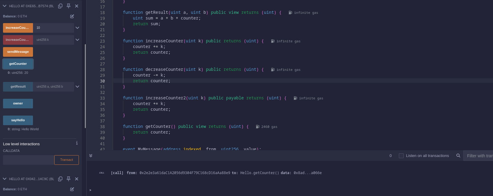

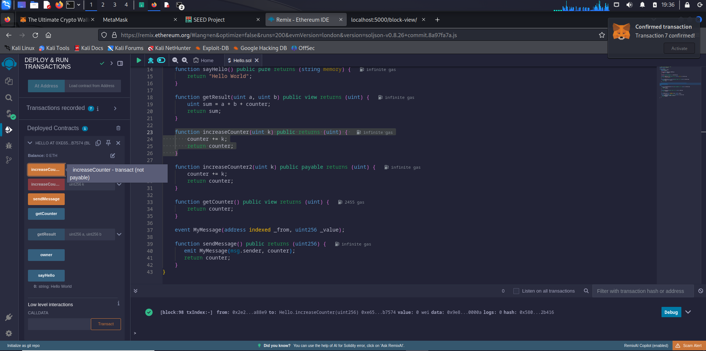

Additionally, we implemented a new function called `decreaseCounter(unit)` in the contract. After redeploying the modified contract, we interacted with this new function as well, confirming that it correctly adjusted the counter according to the specified input. The transaction details, including the amount of gas consumed and the resulting state changes, were monitored using EtherView:

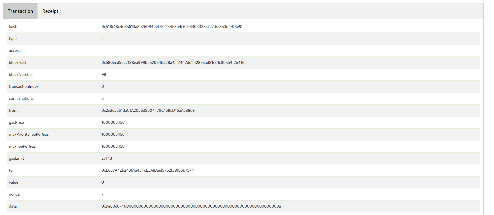

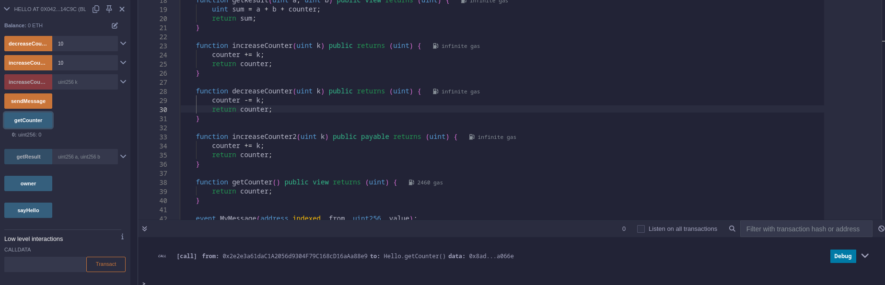

### Task 2.C - Under the hood

In this task, we explored what happens when a function is invoked via a transaction. Specifically, we analyzed the `increaseCounter()` function call by examining the `to` and `data` fields of the transaction. The to field refers to the address of the deployed smart contract, while the data field contains the encoded function selector and arguments:

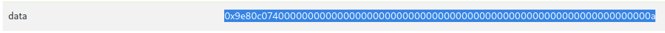

The function selector, which is the first 4 bytes of the hash of the function’s prototype `increaseCounter()`, was located at the start of the data field. The rest of the data field contained the function arguments, encoded according to the ABI (Application Binary Interface) standard, using 32-byte chunks for each argument.

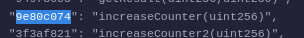

To further understand this, we used EtherView to retrieve the transaction details and verified that the data field contained the correct encoding for the `increaseCounter()` function call:

```python
from web3 import Web3
hash = Web3.sha3(text="<function signature>")
print(hash.hex())
```

After confirming the encoding, we manually constructed a low-level transaction by inputting the appropriate data into the CALLDATA field within Remix's "Low-level interactions" section. This method successfully invoked the function, demonstrating how function calls are processed in smart contracts at a lower level.

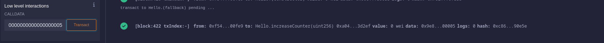

### Task 2.D - Emit events

In this task, we focused on how to emit and capture events during the execution of smart contract functions. To explore this, we modified the `increaseCounter()` function in our smart contract to emit an event called `CounterUpdated`. 

```sol
event MyMessage(address indexed _from, uint256 _value);

function sendMessage() public returns (uint256) {
    emit MyMessage(msg.sender, counter);
    return counter;
}
```

This event included the new value of the counter as a parameter. After updating the contract and deploying it to the SEED emulator, we invoked the `increaseCounter()` function and observed that the event was correctly emitted and recorded on the blockchain. Using EtherView, we examined the transaction logs, which included the CounterUpdated event with its associated data, proving that the event emission occurred:

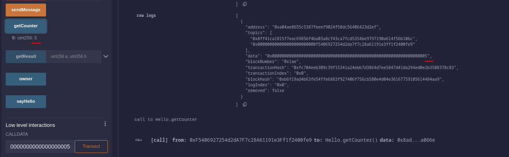

## Task 3 - Send Fund to Contract

In this task the aim is to send fund to a contract. For this task we use the `EtherFaucet.sol` contract. To send fund to a smart contract there are several functions that can be invoked depending on the situation. In this task we experimented with each situation.

### Task 3.A - Send fund directly to a contract address
In this task, we send the fund directly to another contact using the contact's address, through a transaction. So, we used metamask to send the fund to `EtherFaucet` (with its address).

After the transaction is complete, you can check the balance of the smart contract.

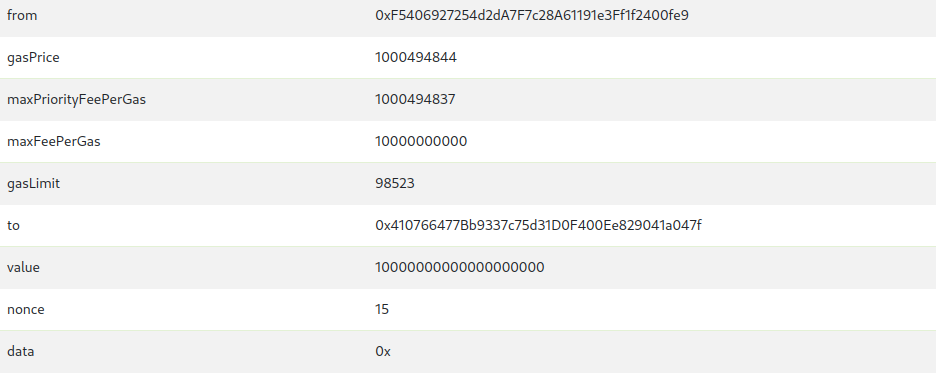

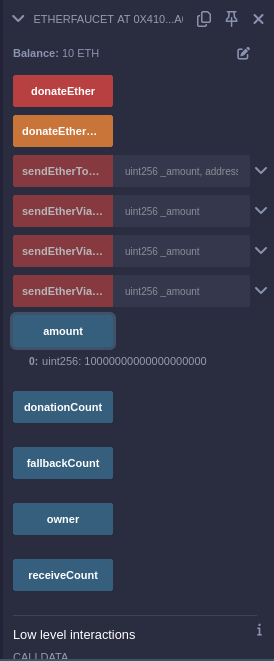

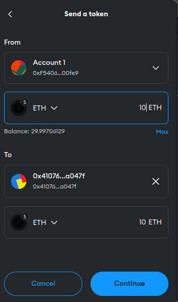


### Task 3.B - Send fund to a payable function
In this task, we send the fund by calling a payable function. We invoke the `donateEther()` function (code shown below) to send the fund to the contract.

```python
function donateEther() external payable {
    amount += msg.value;
    donationCount += 1;
}
```
The amount that is sent to the contract is present in the `value` of the transaction, so the function we presented earlier can access the amount via the `msg.value` variable. Below is shown the balance.

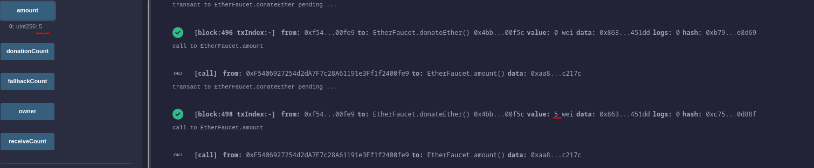

### Task 3.C - Send fund to a non-payable function

In this task, we tested the use of the previously created function, `donateEther()`, without the keyword `payable` and checked what warnings appeared. Functions that receive funds must be payable.

In this task, we tested the use of the previously created function `donateEther()` without the keyword payable and verified that warnings appeared. Functions that receive funds must be payable.

```python
function donateEtherWrong() external {
donationCount += 1;
}
```

We have concluded that it is not possible to carry out this transaction and the funds are not lost. However, the amount spent on the gas previously is not returned.

### Task 3.D - Send fund to a non-existing function

In this task, we again send funds to a contract by calling a function. However, the goal was to call a function that doesn't exist in the contract. To call me a function that doesn't exist, we had to set `data` value of the transaction.
Then we call the `foo()` function, which doesn't exist.

We verified that in this situation the `fallback()` function is invoked, and no funds are sent except for the gas.

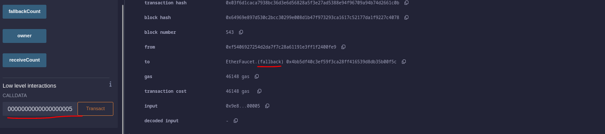

## Task 4 - Send Fund from Contract

In the previous task we learned how to send funds to a contract, but in this one we will instead send funds from an existing contract. For that we will use the **EtherFaucet** contract to send Eth to an EOA. In real contracts there is a check to prevent unauthorized transfers, but this one has none. The ethereum blockchain has 3 functions for smart contracts to transfer money: **Call**, **Send** and **Transfer**. The main difference between them is that call as an unlimited gas limit and send and transfer have a limit of 2300. This means that if funds are sent over to another contract, this one can only execute its function with the remaining gas. If the ammount of total gas used is more than 2300, then the function will not execute using the send and transfer methods. This restriction means that some functions won't work as expected, however this also provides some security as it prevents reentrency attacks as this types work by executing functions over and over again, by limiting the ammount of gas to a set ammount this prevents the abuse of such exploit. 

For this task, we first compiled the contract then deployed it. We the, using metamask, sent over 10 Eth to the contract. After that we sent 1 Eth from each of the three functions as we can see bellow:

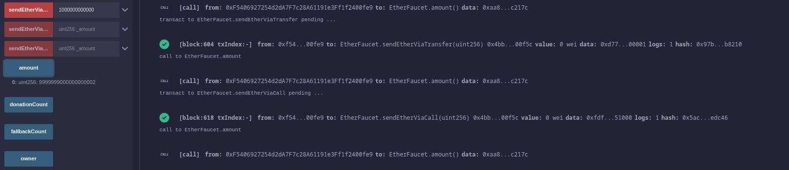
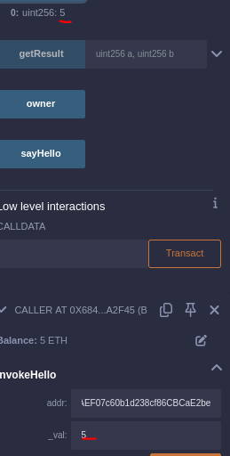
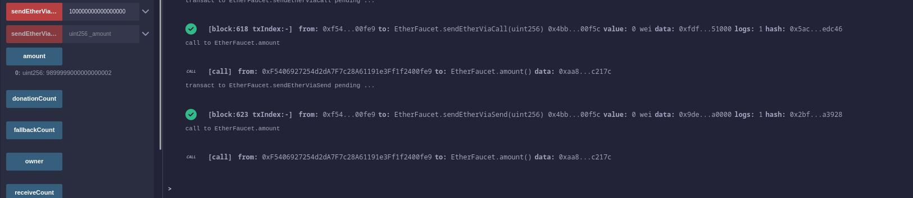
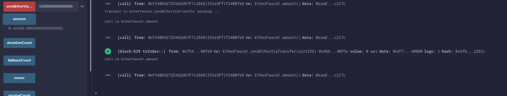

As we can see, all 3 methods successfully send 1 ether to the sender. This is because it sends the funds to an EOA and not a contract where there is complex logic and the gas fees can run out.  

## Task 5 - Invoke Another Contract

In this task, the aim was to understand how the invocation of functions from other contracts works within one. To accomplish this task, we use the `Caller.sol` contract to invoke the functions in the `Hello.sol` contract. Here it is important to note that an interface derived from the `Hello` contract has been created (in the code provided), which allows you to create a contract object and through the API in the interface call the functions of the `Hello` contract.

Firstly, we delploy the **Hello.sol** contract so that we can call it in a later date. We then deploy the **Caller.sol** that will use an API to run parts of the code of the Hello.sol contract.
To do this we invoke the `invokeHello()` function, which just invokes the `Hello` contract function `increaseCounter()`. No transfer happened here, just increments the counter with the value supplied in the function argument.
Below is the function code and a screenshot that shows the balance after the operation.

```python
function invokeHello(address addr, uint _val) public returns (uint) {
    Hello c = Hello(addr);
    uint256 v = c.increaseCounter(_val);
    emit ReturnValue(msg.sender, v);
    return v;
}
```

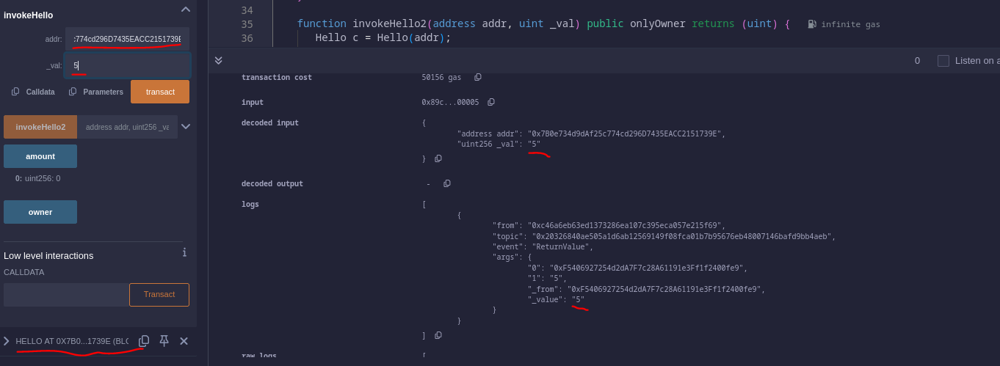

Next, we invoked the `invokeHello2()` function, which sends the fund (1 ETH), if that amount is available, when the `Hello` contract function `increaseCounter2()` is invoked. 
Below is the code for the `invokeHello2()` function and a screenshot showing the difference of 1ETH in the `Caller` contract after the operation has been performed (since there were 5 ETH in the balance of the contract).

```python
function invokeHello2(address addr, uint _val) public onlyOwner returns (uint) {
    Hello c = Hello(addr);
    uint256 v = c.increaseCounter2{value: 1 ether}(_val);
    emit ReturnValue(msg.sender, v);
    return v;
}
```

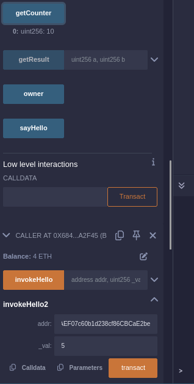

The following table shows a summary of the 2 functions used in the **Caller.sol** and their main distinctions:

| Function       | Ether Transfer       | Caller Restriction       | Target Function in `Hello`   |
|----------------|----------------------|---------------------------|------------------------------|
| `invokeHello`  | No ether transfer    | Anyone can call          | `increaseCounter(uint k)`    |
| `invokeHello2` | Transfers 1 ether    | Only contract owner      | `increaseCounter2(uint k)`   |

## Conclusion
This lab, allowed us to have further learn how the Ethereum Blockchain works by interacting with one of its main features: smart contracts. This pieces of code allow for code execution right on the blockchain and we learned how to compile, deploy and run them. We also learned many of their features and possible security problems such as the  Reentrancy Attack.